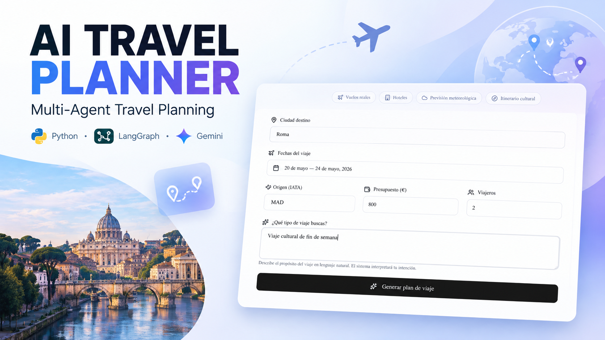
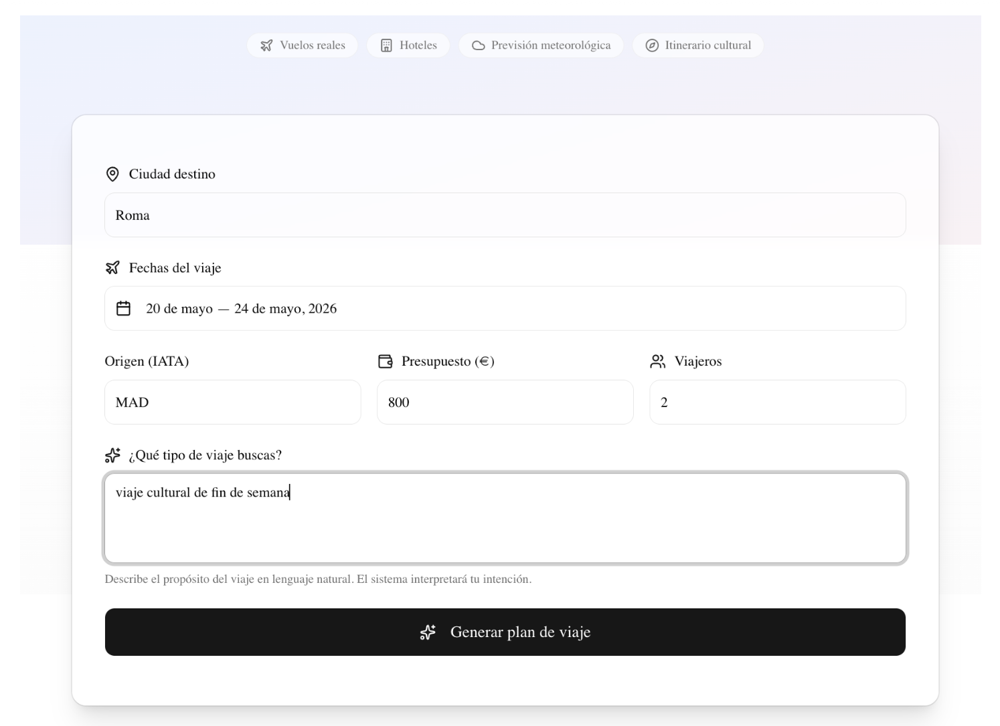
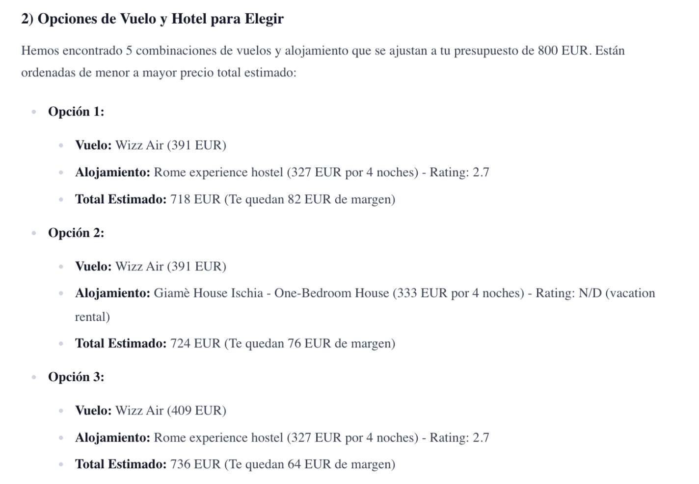
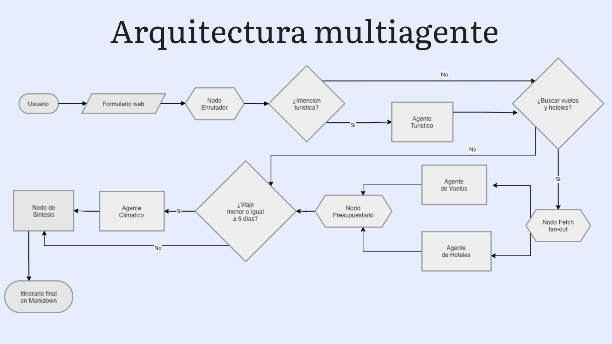

# ✈️ Multi-Agent Travel Planner

> Sistema multiagente de planificación de viajes desarrollado como Trabajo de Fin de Grado (TFG).
>
> A partir de una petición de viaje en lenguaje natural, el sistema coordina agentes especializados para generar un itinerario que combina recomendaciones turísticas, vuelos, hoteles, previsión meteorológica y validación presupuestaria.

[](https://www.python.org/)
[](https://www.langchain.com/)
[](https://langchain-ai.github.io/langgraph/)
[](https://ai.google.dev/gemini-api/docs)
[](#pruebas)

---


## Demo

[](https://youtu.be/DeOW7qzDR5E)

**▶ Ver vídeo con la demostración completa del sistema**

En esta demo se muestra el funcionamiento del sistema desde la introducción de
los parámetros del viaje hasta la generación del itinerario final.

---

## Aplicación

### Planificación del viaje



El usuario introduce el destino, fechas, presupuesto, número de viajeros y
describe en lenguaje natural el objetivo del viaje.

### Resultado generado



El sistema combina la información obtenida por los diferentes agentes y genera
un plan de viaje estructurado.


---

## Arquitectura del sistema

El sistema utiliza una arquitectura multiagente basada en **LangGraph**, donde un
supervisor coordina diferentes agentes especializados según las características
de cada petición.



### Flujo de ejecución

1. **Supervisor / Router**  
   Analiza la petición del usuario y determina qué agentes deben ejecutarse.

2. **Agente turístico**  
   Genera el contexto y las recomendaciones relacionadas con el destino y el
   propósito del viaje.

3. **Agente de vuelos**  
   Consulta y procesa opciones de vuelos mediante SerpApi.

4. **Agente de hoteles**  
   Consulta y procesa opciones de alojamiento mediante SerpApi.

5. **Agente meteorológico**  
   Obtiene la previsión meteorológica mediante OpenWeather cuando el horizonte
   temporal del viaje lo permite.

6. **Nodo presupuestario**  
   Calcula y valida las combinaciones de vuelos y hoteles frente al presupuesto
   indicado utilizando lógica determinista en Python.

7. **Nodo de síntesis**  
   Integra los resultados obtenidos y genera el itinerario final estructurado.

El flujo se adapta dinámicamente a cada solicitud. Por ejemplo, el agente
meteorológico se omite cuando el viaje se encuentra fuera del horizonte de
previsión utilizado por el sistema, mientras que vuelos y hoteles pueden
ejecutarse en paralelo para reducir la latencia.


## Descripción

Planificar un viaje implica normalmente combinar información procedente de múltiples servicios: vuelos, alojamiento, meteorología y actividades. Este proyecto propone una arquitectura que centraliza ese proceso y permite generar un plan de viaje a partir de una única petición.

El sistema está diseñado alrededor de un **grafo de orquestación multiagente**. Un supervisor analiza la petición, decide qué agentes son necesarios y coordina su ejecución. La lógica determinista —como el enrutamiento, el cálculo de costes y el filtrado presupuestario— permanece fuera del LLM, mientras que el modelo generativo se utiliza allí donde aporta valor: interpretación semántica, contexto turístico y síntesis del resultado.

El objetivo no es únicamente generar texto, sino **combinar razonamiento generativo con datos externos y reglas explícitas de negocio**, manteniendo el flujo trazable, modular y reproducible.

---

## Características principales

- **Arquitectura multiagente** coordinada mediante LangGraph.
- **Enrutamiento dinámico** en función de la intención del usuario, las fechas y el presupuesto.
- **Búsqueda de vuelos** mediante SerpApi / Google Flights.
- **Búsqueda de hoteles** mediante SerpApi / Google Hotels.
- **Información meteorológica** mediante OpenWeather.
- **Google Gemini** para interpretación semántica y generación del contenido final.
- **Validación presupuestaria determinista** realizada en Python, fuera del LLM.
- **Ejecución en paralelo** de las consultas de vuelos y hoteles.
- **Resiliencia ante fallos** mediante reintentos, backoff exponencial y fallback entre modelos Gemini.
- **Modos Live / Cache / Mock** para separar desarrollo, demostración y consumo de APIs reales.
- **Gestión de credenciales mediante variables de entorno**.
- **Logging estructurado** para poder seguir la ejecución del grafo.
- **58 pruebas unitarias y de integración** con pytest.
- **API REST** independiente del cliente web.

---


### SupervisorState

Todos los nodos trabajan sobre un estado compartido que acumula la información de la petición durante la ejecución del grafo: destino, fechas, presupuesto, vuelos, hoteles, meteorología, combinaciones validadas y demás resultados intermedios.

### Agentes especializados

| Componente | Responsabilidad |
|---|---|
| **Supervisor / Router** | Decide qué camino debe seguir la petición y qué agentes activar. |
| **Agente Turístico** | Genera el contexto turístico y las recomendaciones asociadas al perfil del viaje. |
| **Agente de Vuelos** | Consulta y normaliza opciones de vuelos. |
| **Agente de Hoteles** | Consulta y normaliza opciones de alojamiento. |
| **Agente Meteorológico** | Consulta la previsión cuando el horizonte temporal lo permite. |
| **Nodo Presupuestario** | Calcula combinaciones vuelo + hotel y filtra por presupuesto. |
| **Nodo de Síntesis** | Integra la información validada y genera el informe final. |

---

## Enrutamiento dinámico

El grafo no sigue siempre el mismo camino. El supervisor evalúa la petición y adapta la ejecución.

### 1. Horizonte temporal

- **Viaje a 5 días o menos:** se activa el agente meteorológico.
- **Viaje a más de 5 días o sin fecha:** se omite el agente meteorológico.

### 2. Presupuesto

Si el usuario define un presupuesto, el sistema genera las combinaciones posibles entre vuelos y hoteles, calcula su coste total y separa las opciones válidas de las que exceden el límite.

Cuando ninguna combinación entra dentro del presupuesto, el sistema aplica una estrategia de degradación tolerante y devuelve alternativas próximas al límite en lugar de finalizar con un resultado vacío.

### 3. Intención del viaje

La petición puede representar una planificación turística completa o una consulta principalmente logística. En una petición estrictamente logística, el agente turístico puede omitirse para reducir latencia y consumo de tokens.

---

## Validación presupuestaria determinista

Una decisión de diseño central del proyecto es evitar que el LLM realice operaciones financieras.

El flujo es:

```text
Vuelos + Hoteles
       │
       ▼
Normalización de precios
       │
       ▼
Generación de combinaciones
       │
       ▼
Cálculo total en Python
       │
       ├── Dentro de presupuesto ──► Resultado válido
       │
       └── Fuera de presupuesto ──► Excluido / sugerencia
```

El LLM recibe datos ya procesados y validados, no los utiliza como calculadora.

---

## Integraciones externas

### Google Gemini

Se utiliza como modelo generativo para las tareas que requieren interpretación y generación de lenguaje. El proyecto contempla distintas variantes de Gemini y utiliza un mecanismo de fallback para reducir el impacto de errores temporales del proveedor.

### SerpApi

Se utiliza como fuente para:

- Google Flights
- Google Hotels

Las consultas de vuelos y hoteles se ejecutan en paralelo cuando ambas son necesarias.

### OpenWeather

Proporciona información meteorológica para el destino. El supervisor evita consultar este servicio cuando la fecha del viaje queda fuera del horizonte utilizado por el sistema.

---

## Estrategia Live / Cache / Mock

Para reducir costes y hacer las pruebas reproducibles, el sistema incorpora tres modos de acceso a datos:

| Modo | Descripción | Uso recomendado |
|---|---|---|
| `live` | Consulta las APIs reales. | Validación con datos reales |
| `cache` | Reutiliza respuestas previamente guardadas. | Desarrollo y repetición de escenarios |
| `mock` | Utiliza datos estáticos deterministas. | Tests, demos y desarrollo offline |

Esta separación permite probar la lógica del sistema sin depender constantemente de la disponibilidad, latencia o cuota de los servicios externos.

---

## Resiliencia y observabilidad

Las integraciones con modelos y APIs externas pueden fallar. Para evitar que un error puntual derribe todo el grafo, el proyecto incorpora:

- Reintentos automáticos.
- Backoff exponencial.
- Fallback entre modelos Gemini configurados.
- Timeouts configurables.
- Logging estructurado en los nodos principales.
- Modos `cache` y `mock` para aislar problemas externos.

Los logs permiten reconstruir el recorrido de una petición y comprobar las decisiones de enrutamiento y los resultados intermedios.

---

## Stack tecnológico

### Backend

- **Python 3.14+**
- LangChain
- LangGraph
- Google Gemini
- Pytest
- Requests
- `venv`

### Datos y servicios externos

- SerpApi
- Google Flights
- Google Hotels
- OpenWeather

### Frontend

- Next.js
- Node.js 20+
- npm

### Herramientas

- Git / GitHub
- Visual Studio Code

---

## Requisitos previos

Antes de ejecutar el proyecto necesitas:

- Python 3.14 o superior.
- Node.js 20 o superior.
- npm.
- Git.
- Conexión a Internet para instalar dependencias.
- Claves de API de Google Gemini, SerpApi y OpenWeather si quieres utilizar el modo `live`.

El modo `mock` permite trabajar con datos simulados sin depender de las APIs externas durante la ejecución.

---

## Instalación

### 1. Clonar el repositorio

```bash
git clone https://github.com/apo33-ua/TFG.git
cd TFG
```

### 2. Crear el entorno virtual

#### macOS / Linux

```bash
python3 -m venv tfg_env
source tfg_env/bin/activate
```

#### Windows

```powershell
python -m venv tfg_env
tfg_env\Scripts\activate
```

### 3. Instalar las dependencias del backend

```bash
pip install -r requirements.txt
```

### 4. Instalar las dependencias del frontend

```bash
cd frontend
npm install
cd ..
```

---

## Configuración

Crea un fichero `.env` en la raíz del proyecto:

```env
GEMINI_API_KEY=tu_clave_de_gemini
SERPAPI_API_KEY=tu_clave_de_serpapi
OPENWEATHER_API_KEY=tu_clave_de_openweather

# live | cache | mock
TRAVEL_DATA_MODE=mock

# Modelos candidatos para fallback
GEMINI_MODEL_CANDIDATES=gemini-2.5-flash,gemini-2.5-pro,gemini-2.5-flash-lite

# Resiliencia
GEMINI_RETRIES=3
GEMINI_BACKOFF_BASE_SECONDS=1.5
GEMINI_TIMEOUT_SECONDS=30
```

El fichero `.env` debe mantenerse fuera del control de versiones.

### Configuración del frontend

Crea `frontend/.env.local`:

```env
NEXT_PUBLIC_API_URL=http://127.0.0.1:8000
```

---

## ▶Ejecución con interfaz web

La forma recomendada de utilizar el sistema es mediante la interfaz web.

### Terminal 1 — Backend

```bash
source tfg_env/bin/activate
uvicorn api:app --reload --port 8000
```

Backend:

```text
http://127.0.0.1:8000
```

Documentación interactiva:

```text
http://127.0.0.1:8000/docs
```

### Terminal 2 — Frontend

```bash
cd frontend
npm run dev
```

Frontend:

```text
http://localhost:3000
```

El frontend envía la petición al endpoint `POST /plan`, el backend ejecuta el grafo y devuelve el resultado que se representa en la interfaz.

---

## Ejecución por CLI

El punto de entrada principal para ejecutar una planificación desde terminal es:

```bash
python3 supervisor_viajes.py "Roma"
```

Ejemplo completo:

```bash
python3 supervisor_viajes.py "Roma" \
  --contexto "viaje cultural" \
  --fecha-inicio 2026-06-15 \
  --fecha-fin 2026-06-18 \
  --origen MAD \
  --presupuesto 800 \
  --adultos 2
```

### Parámetros principales

| Parámetro | Descripción |
|---|---|
| `ciudad` | Ciudad destino. |
| `--contexto` | Descripción libre del viaje. |
| `--objetivo` | Objetivo específico del usuario. |
| `--fecha-inicio` | Fecha de inicio (`YYYY-MM-DD`). |
| `--fecha-fin` | Fecha de fin (`YYYY-MM-DD`). |
| `--origen` | Código IATA del aeropuerto de origen. |
| `--destino-iata` | Código IATA del aeropuerto de destino. |
| `--presupuesto` | Presupuesto máximo en euros. |
| `--adultos` | Número de viajeros adultos. |

---

## Ejecución de agentes individuales

Cada agente puede ejecutarse de forma aislada para facilitar las pruebas y la depuración.

### Clima

```bash
python3 agente_clima.py "Roma" --fecha 2026-06-15
```

### Vuelos

```bash
python3 agente_vuelos.py MAD FCO 2026-06-15 --vuelta 2026-06-18 --adultos 2
```

### Hoteles

```bash
python3 agente_hoteles.py "Roma" 2026-06-15 2026-06-18 --adultos 2
```

### Turismo

```bash
python3 agente_turistico.py "Roma" --contexto "viaje cultural"
```

---

## Pruebas

La memoria del proyecto documenta una suite de **58 tests unitarios y de integración**, utilizando mocks para aislar las llamadas a Gemini, SerpApi y OpenWeather.

Para ejecutarla:

```bash
pytest tests/ -v
```

El modo `mock` permite realizar pruebas reproducibles sin depender de las cuotas ni de la disponibilidad de servicios externos.

---

## Decisiones técnicas destacadas

### Separación entre lógica determinista y generación

El sistema evita delegar en el LLM decisiones que pueden expresarse mediante reglas explícitas. El supervisor, el enrutamiento y el cálculo presupuestario se ejecutan mediante lógica Python.

### Componentes con responsabilidad única

Cada agente se especializa en un dominio y expone un flujo de entrada/salida claro. Esto facilita las pruebas, el aislamiento de fallos y la ampliación futura de la arquitectura.

### Configuración por entorno

Las credenciales, el modo de datos, la selección de modelos, los timeouts y la política de reintentos se controlan mediante variables de entorno para evitar acoplar estos parámetros al código.

---

## API principal

### `POST /plan`

Endpoint principal del backend. Recibe los parámetros del viaje y devuelve el plan generado por el orquestador.

Ejemplo conceptual de entrada:

```json
{
  "destino": "Roma",
  "fecha_inicio": "2026-06-15",
  "fecha_fin": "2026-06-18",
  "origen": "MAD",
  "adultos": 2,
  "presupuesto": 800,
  "contexto": "viaje cultural de fin de semana"
}
```

La salida integra los resultados de los agentes y genera el informe final.

---

## Limitaciones conocidas

La versión actual mantiene deliberadamente un alcance acotado. Entre las principales limitaciones documentadas se encuentran:

- Un único destino por consulta.
- Resolución de códigos IATA dependiente del LLM cuando el usuario no proporciona el código.
- Interfaz inicial centrada principalmente en el backend de orquestación.
- Fechas de viaje fijas, sin búsqueda automática de fechas flexibles.
- Sin persistencia entre sesiones.
- Sin sistema de usuarios y perfiles.
- Respuestas generadas en español.

Estas limitaciones forman parte del alcance actual del TFG y no del diseño fundamental de la arquitectura.

---

## Documentación

La memoria completa del Trabajo de Fin de Grado contiene la documentación detallada de:

- Requisitos funcionales y no funcionales.
- Casos de uso.
- Arquitectura lógica.
- Flujo completo de ejecución.
- Tecnologías y decisiones técnicas.
- Estrategia Live / Cache / Mock.
- Estudio de viabilidad económica.
- Limitaciones y trabajo futuro.
- Manual de instalación y uso.

---

## Autor

**Alejandro Palomares Orugo**  
Grado en Ingeniería Informática · Universidad de Alicante

- GitHub: https://github.com/apo33-ua
- LinkedIn: https://www.linkedin.com/in/alex-palomares4

---

## Proyecto académico

Este repositorio contiene el desarrollo del **Trabajo de Fin de Grado** y tiene como objetivo mostrar el diseño e implementación de un sistema multiagente aplicado a la planificación automática de viajes.

